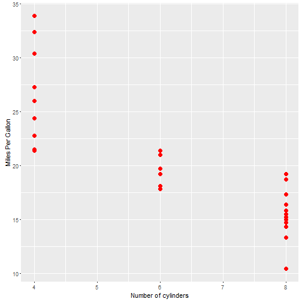

## Agenda

1. Purpose and Information
2. Embedded R Code  
3. Instructions to use

--- .class #id

## 1. Purpose and Information


This Shiny application is my submission for the assignment of the course Developing Data Products, part of the Data Science Specialization offered by the Johns Hopkins University. This is an interactive web based application, frameworked in R, for Automobile Exploratory Data Analysis

This application is built based on the data of 1974 Motor Trend US magazine, and comprises fuel consumption and 10 aspects of automobile design and performance for 32 automobiles (1973 - 74 models).

ggplot2 was used for the plotting. The following page is the code for a static view of the default plot that is rendered on the web app


---
Embedded R Code

```r
library(ggplot2); data(mtcars); dataset <- mtcars
ggplot(dataset,aes_string(x='cyl', y='mpg')) + geom_point() + geom_point(size=3,color='red') +
labs( x= 'Number of cylinders', y = "Miles Per Gallon") 
```



---

## 3. Instructions to use
To reproducing this app locally on your computer, you would need to follow these steps:

1. Install rstudio if you don't have one.
2. Install the necessary packages to run RStudio's Shiny server locally, go to this link for more detail: <http://shiny.rstudio.com/articles/shinyapps.html>
3. Copy server.R, ui.R and README.md files from <https://github.com/ksyanks/shinyapp> to your local. These files (server.R, ui.R and README.md) you find them the above given link at GitHub.
Please place the files into an directory example, mpg directory, set your working 1 level above mpg directory. You can launch the app in R with the following commands:

install.packages("shiny")     
library(shiny)     
runApp('mpg')       


